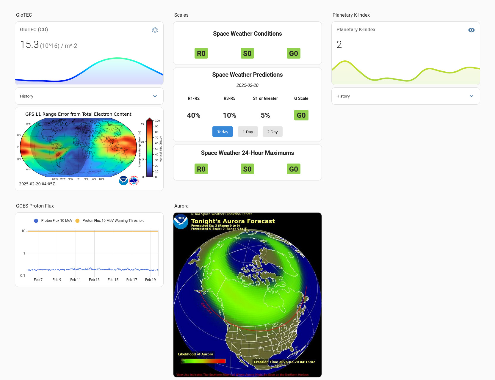

# ha-noaa-space-weather

_NOAA space weather data in Home Assistant._

I work in a field that is affected by space weather and wanted an easy way to tell at a glance if something funny is
going on up there. This is a plugin for Home Assistant that adds space weather data and predictions to your dashboard.
Data is sourced from the NOAA Space Weather Prediction Center.



## 🚀 New to Home Assistant or this integration?

Check out the **[Quick Start Guide](QUICKSTART.md)** for step-by-step beginner-friendly instructions!

## ✨ Simplified Installation

This component has been streamlined for easy deployment. **No external services, MQTT, or Redis required!**

### Option 1: HACS (Recommended)

1. Open HACS in Home Assistant
2. Click the three dots in the top right corner
3. Select "Custom repositories"
4. Add this repository URL: `https://github.com/BojanKV/ha-noaa-space-weather`
5. Select category: "Integration"
6. Click "Install"
7. Restart Home Assistant
8. Add to your `configuration.yaml` (see Configuration section below)

### Option 2: Manual Installation

1. Copy the `custom_components/space_weather` folder from this repository to your Home Assistant `config/custom_components` directory
   - Final path should be: `config/custom_components/space_weather/`
2. Restart Home Assistant
3. Add to your `configuration.yaml` (see Configuration section below)

## ⚙️ Configuration

Add this to your `configuration.yaml`:

### Basic Configuration (without GloTEC)

```yaml
sensor:
  - platform: space_weather
```

This will provide all sensors except GloTEC (Solar Scales, Predictions, K-Index, Proton Flux, Aurora Forecast).

### Full Configuration (with GloTEC)

To enable the GloTEC sensor, you need to specify your geographic region of interest:

```yaml
sensor:
  - platform: space_weather
    lat_range_min: 25.0    # Southern boundary of your region
    lat_range_max: 50.0    # Northern boundary of your region
    lon_range_min: -125.0  # Western boundary of your region
    lon_range_max: -65.0   # Eastern boundary of your region
```

**Finding Your Coordinates:**
- Use a map service to find the latitude and longitude boundaries of your region
- For the USA: approximately lat 25-50, lon -125 to -65
- For Europe: approximately lat 35-70, lon -10 to 40

After adding the configuration, restart Home Assistant.

## 📊 Available Sensors

The integration provides the following sensors:

### NOAA Space Weather Scales (Current & 24hr Max)
- **R-Scale**: Radio Blackouts
- **S-Scale**: Solar Radiation Storms  
- **G-Scale**: Geomagnetic Storms

### Predictions (Today, 1-day, 2-day)
- Solar radiation probabilities
- Geomagnetic storm forecasts
- Radio blackout predictions

### Real-time Data
- **Planetary K-Index**: Updated every 5 minutes
- **Proton Flux (10 MeV)**: Solar particle levels
- **Aurora Forecast Coverage**: Percentage of aurora coverage
- **GloTEC**: Global Total Electron Content for your region (optional)

## 🎨 Dashboard Cards

Custom Lovelace cards are available in the `dashboard/www` folder.

1. Copy files from `dashboard/www/` to your `config/www/` folder
2. In your dashboard: `Edit` → `⋮` → `Manage resources`
3. Add these resources:
   ```
   /local/space-weather-card.js
   /local/space-weather-24hr-max-card.js
   /local/space-weather-pred-card.js
   ```
4. Add cards to your dashboard using Manual card type:
   ```yaml
   type: space-weather-current
   ```
   ```yaml
   type: space-weather-24hr-max
   ```
   ```yaml
   type: space-weather-prediction-1day
   ```

See `dashboard/README.md` for more details.

## 🔗 Related Projects

Works well with [tcarwash/home-assistant_noaa-space-weather](https://github.com/tcarwash/home-assistant_noaa-space-weather). Both provide Planetary K-Index, but this integration is updated every 5 minutes. SWPC publishes new data every 1 minute.

## 📚 References

- GloTEC: <https://www.swpc.noaa.gov/products/glotec>
- GloTEC Technical: <https://www.gps.gov/cgsic/meetings/2023/fang.pdf>
- NOAA Space Weather Scales: <https://www.swpc.noaa.gov/noaa-scales-explanation>

## 📁 Legacy Components

The `feeder/` directory contains the legacy external service implementation that required Redis, MQTT, and systemd services. **This is no longer needed** as GloTEC functionality is now integrated directly into the custom component.
